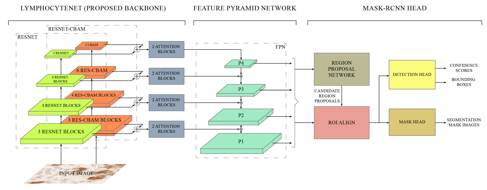

# Exploitation of Mask-RCNN for the detection of Lymphocytes in histopathological images

## Abstract

Cancer is one of the most commonly occurring deadly diseases around the world. Lymphocytes are considered as an indicator of cancer, which accumulates at the site of tumor regions in response of immune system. Lymphocyte’s detection and quantification play an important role in determining the cancer progression and therapeutic efficacy. However, automation of lymphocyte detection system using Machine learning techniques poses a number of challenges such as unavailability of annotations, sparse representation of lymphocytes, and irregular deposition of stains and presence of artifacts, which gives the false impression of lymphocytes on tissues. Therefore, this project aims to develop an automated detection of lymphocyte in histopathological images. In this regard, the idea of Channel Boosting is used in the backbone of Mask-RCNN to improve its feature extraction ability. Two different backbones are integrated using custom attention blocks and by applying addition operation. An open-source dataset LYSTO is used to evaluate the proposed LymphocyteNet on open-source dataset LYSTO and compared the performance with state-of-the-art architectures. The proposed channel boosted architecture shows improvement in performance in terms of kappa (0.9044), f-score (0.8930), precision (0.8919) and recall (0.8940). The learning capacity of the proposed LymphocyteNet is further evaluated by performing multi-class detection on H&E stained NuCLS dataset. The proposed LymphocyteNet shows good generalization with an f-score of 0.725. The promising result suggests that the idea of channel boosting enhances the learning capacity and can be exploited to improve the detection on complex datasets.

## Demo

https://www.youtube.com/watch?v=k0JHGUCu158

## Dataset

[LYSTO Dataset](https://lysto.grand-challenge.org/ "LYSTO Dataset") was used in this research work.

## Proposed Methadology



## Results

|   Backbone of Mask-RCNN    | Recall | Precision | F-Score | Kappa  |
| :------------------------: | :----: | :-------: | :-----: | :----: |
| Proposed LymphocyteNet (+) | 0.8940 |  0.8920   | 0.8930  | 0.9044 |
| Proposed LymphocyteNet (x) | 0.9190 |  0.8530   | 0.8843  | 0.8909 |
|         ResNet-50          | 0.8850 |  0.8650   | 0.8749  | 0.8432 |
|       ResNet-CBAM-50       | 0.8620 |  0.8930   | 0.8777  | 0.8889 |

## Setup

The code in given colab is written using MMDetection toolbox.

1. Open the given notebook in [Google Colab](https://colab.research.google.com/ "Google Colab") using following [link](https://colab.research.google.com/github/abdul2706/Mask-RCNN-LymphocyteNet-Channel-Boosting/blob/main/fyp_maskrcnn_lymphocytenet_channel_boosting.ipynb "link").
2. Run cells one-by-one as written in the notebook up to the cell containing "train_detector(...)" function call.

## How to add new Backbone

The proposed backbone is defined under the section "Define Custom Model". For readibilty it's recommended to add your backbone in same section. The new backbone should be included in two ways: 1) Under `For Colab` cell containing backbone definiton, and 2) Under `For File` cell as a string containing same code, which is used to generate its python file automatically. Following are steps to add new backbone.

### Steps for "For Colab" cell

1. Create new cell and import atleast the following libraries.

   ```python
   import torch
   import torch.nn as nn
   import torch.nn.functional as F
   from mmdet.models import BACKBONES
   ```

2. Define custom model (backbone) as a python class, it must be a child class of `torch.nn.Module` class directly or indirectly. It must be implemented with following function definitions.

   ```python
   class CustomBackbone(Module):
       def __init__(self):
           super(CustomBackbone, self).__init__()
           ...

       def forward(self, x):
           ...

       def init_weights(self, pretrained=None):
           ...
   ```

3. Write following decorator above the defined class.

   ```python
   @BACKBONES.register_module(force=True, name='CustomBackbone')
   class CustomBackbone(Module):
       def __init__(self):
           super(CustomBackbone, self).__init__()
           ...
   ```

4. Use this code to verify and view the working of CustomBackbone class.

   ```python
   images = torch.rand(2, 3, 224, 224).to(device)
   backbone_network = CustomBackbone().to(device)
   print(f'Architecture of {backbone_network.__clas__.__name__}\n', backbone_network)
   backbone_network.init_weights(pretrained=pretrained)
   backbone_network.eval()
   levels = backbone_network(images)
   for i, level in enumerate(levels):
       print(f'level{i} -> {levels[i].shape}')
   ```

### Steps for "For File" cell

1. Copy the above defined code (complete) and paste in the following template.

   ```python
   backbone_file_data = r"""
       # PASTE THE CUSTOM BACKBONE CODE HERE
   """

   backbone_base_path = '/content/mmdetection/mmdet/models/backbones/'
   backbone_file_name = 'custom_backbone.py'
   backbone_file_path = os.path.join(backbone_base_path, backbone_file_name)
   with open(backbone_file_path, 'w') as backbone_file:
       backbone_file.write(backbone_file_data)
       print(f'<backbone_file_data> saved to "{backbone_file_path}"')
   ```

More details at: [customize_models](https://mmdetection.readthedocs.io/en/latest/tutorials/customize_models.html "https://mmdetection.readthedocs.io/en/latest/tutorials/customize_models.html")

## How to add new Hook

The custom evaluation hook is defined under the section "Define Custom Hook". For readibilty it's recommended to add your hook in same section. The new hook should be included in two ways: 1) Under `For Colab` cell containing hook definiton, and 2) Under `For File` cell as a string containing same code, which is used to generate its python file automatically. Following are steps to add new hook.

### Steps for "For Colab" cell

1. Create new cell and import atleast the following libraries.

   ```python
   import mmcv
   from mmcv import Config
   from mmcv.runner import HOOKS, Hook
   from mmdet.apis import single_gpu_test
   ```

2. Define custom hook as a python class, it must be a child class of `mmcv.runner.Hook` class directly or indirectly. To create hook for evaluation purposes the `after_epoch` method must be implemented.

   ```python
   class CustomHook(Hook):
       def __init__(self, path_config, base_dir):
           ...

       def after_epoch(self, runner):
           ...
   ```

3. Write following decorator above the defined class.

   ```python
   @HOOKS.register_module(force=True, name="CustomHook")
   class CustomHook(Module):
       def __init__(self):
           super(CustomHook, self).__init__()
           ...
   ```

### Steps for "For File" cell

1. Copy the above defined code (complete) and paste in the following template.

   ```python
   custom_hook_file_data = r"""
       # PASTE THE CUSTOM HOOK CODE HERE
   """

   custom_hook_base_path = 'mmdet/core/utils/'
   custom_hook_file_name = 'custom_hook.py'
   custom_hook_file_path = os.path.join(custom_hook_base_path, custom_hook_file_name)
   with open(custom_hook_file_path, 'w') as custom_hook_file:
       custom_hook_file.write(custom_hook_file_data)
       print(f'<custom_hook_file_data> saved to "{custom_hook_file_path}"')
   ```

More details at: [customize_runtime](https://mmdetection.readthedocs.io/en/latest/tutorials/customize_runtime.html#customize-hooks "https://mmdetection.readthedocs.io/en/latest/tutorials/customize_runtime.html#customize-hooks")

## How to add new Config

The custom config is defined under the section "Define Custom Config". For readibilty it's recommended to add your config in same section. The new config needs to be written in a string format, which is used to generate its python file automatically. Following are steps to add new config file.

1. Create new cell and add your configurations in the following template.

   ```python
   # create config folder if not already created
   setting1 = 1
   config_base_path = 'configs/custom_config/'
   mmcv.mkdir_or_exist(os.path.abspath(config_base_path))

   # create config file and store config data declared above
   config_file_name = f'custom_config{setting}.py'
   config_file_path = os.path.join(config_base_path, config_file_name)

   # lymph config file content
   config_file_data = f"""
       # WRITE YOUR CONFIG HERE
   """

   with open(config_file_path, 'w') as config_file:
       config_file.write(config_file_data)
       print(f'<config_file_data> saved to "{config_file_path}"')
   ```

More details at: [config](https://mmdetection.readthedocs.io/en/latest/tutorials/config.html "https://mmdetection.readthedocs.io/en/latest/tutorials/config.html")
